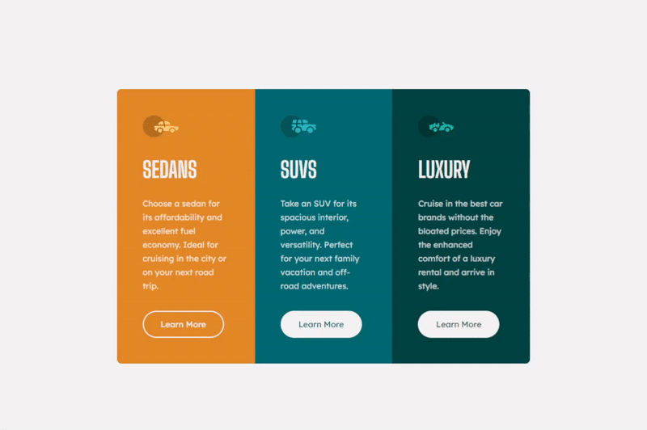

# Frontend Mentor - 3-column preview card component solution

This is a solution to the [3-column preview card component challenge on Frontend Mentor](https://www.frontendmentor.io/challenges/3column-preview-card-component-pH92eAR2-). Frontend Mentor challenges help you improve your coding skills by building realistic projects.

## Table of contents

- [Frontend Mentor - 3-column preview card component solution](#frontend-mentor---3-column-preview-card-component-solution)
  - [Table of contents](#table-of-contents)
  - [Overview](#overview)
    - [The challenge](#the-challenge)
    - [Screenshot](#screenshot)
    - [Links](#links)
  - [My process](#my-process)
    - [Built with](#built-with)
    - [Useful resources](#useful-resources)
  - [Author](#author)

## Overview

### The challenge

Users should be able to:

- View the optimal layout depending on their device's screen size
- See hover states for interactive elements

### Screenshot

### Links

- Solution URL: [frontendmentor.io/solutions/3column-preview-card-with-grid-sassscss-react-Hb9gHVw2q](https://www.frontendmentor.io/solutions/3column-preview-card-with-grid-sassscss-react-Hb9gHVw2q)
- Live Site URL: [3-column-preview-card-component-mu-silk.vercel.app](https://3-column-preview-card-component-mu-silk.vercel.app/)

## My process

### Built with

- Semantic HTML5 markup
- CSS custom properties
- Flexbox
- Desktop-first workflow
- [React](https://reactjs.org/) - JS library
- SASS/SCSS - For styles

### Useful resources

- [Pixel Perfect Pro](https://addons.mozilla.org/en-US/firefox/addon/pixel-perfect-pro/) - This helped me to display a screenshot on top of the webpage to easily check if dimensions were accurate. This is super useful is you need to create pixel perfect work.
- [PX: Viewport Dimensions](https://addons.mozilla.org/en-US/firefox/addon/px-viewport-dimensions/) - This add-on will show you the dimensions of your viewport while resizing your browser.
- [Gimp](https://www.gimp.org/) - This helped me resize screenshots provided in the project
- [Figma](https://www.figma.com) - This helped me create a rapid mockup to get dimensions of components.

## Author

- 🚀 Frontend Mentor - [@melwynt](https://www.frontendmentor.io/profile/melwynt) 
- 🐦 Twitter: [@melwyncode](https://twitter.com/melwyncode) 
- 🧑‍💻 LinkedIn: [melwynturbant](https://www.linkedin.com/in/melwynturbant)
